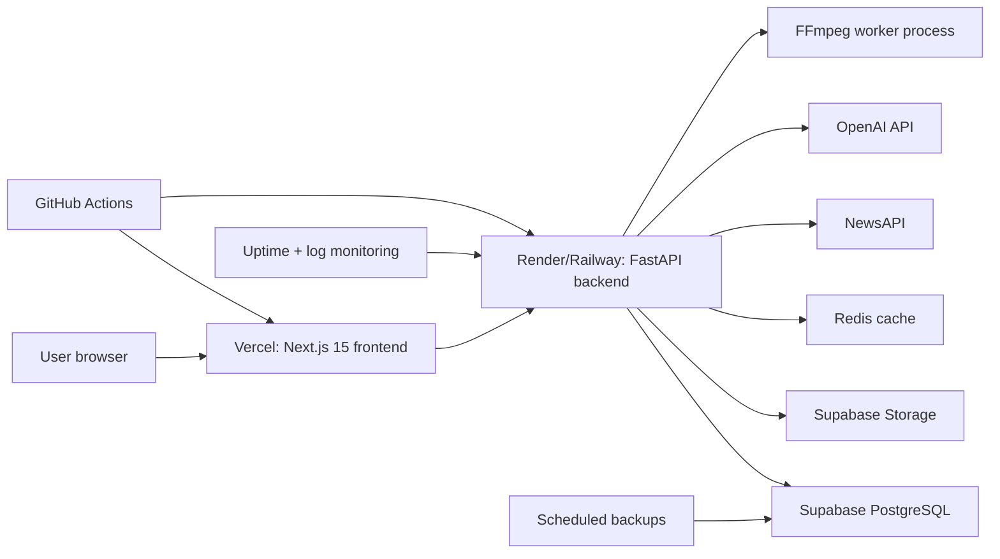

# Infrastructure Diagram

## Runtime Boundaries

- Browser calls the backend over HTTPS.
- Backend owns all service-role secrets.
- Frontend only receives public Supabase values and backend URL.
- Sign clip uploads and generated sequence outputs are stored in Supabase Storage.
- Avatar research remains outside production routing.
